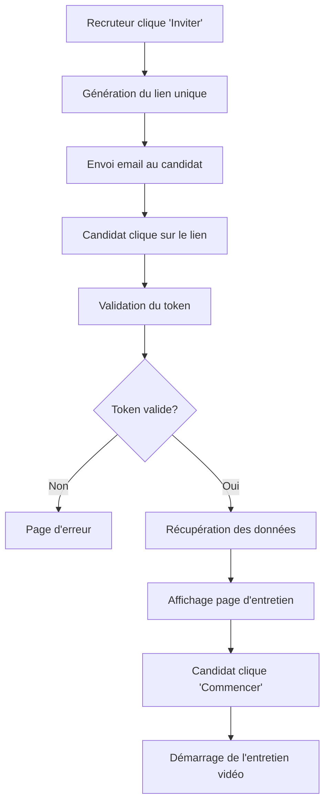

# Page d'Entretien pour les Candidats - JobGate

## Vue d'ensemble

Quand un candidat reçoit un email d'invitation à un entretien vidéo et clique sur le lien, il est redirigé vers une page dédiée qui affiche les détails de la campagne d'entretien et de l'offre d'emploi. Cette page lui permet de visualiser toutes les informations importantes avant de commencer son entretien vidéo différé.

## Fonctionnement du Système

### 1. Processus d'Invitation
1. **Le recruteur** clique sur "Inviter" pour un candidat depuis la liste des candidatures
2. **Le système** génère un lien unique avec un token sécurisé : `http://localhost:3000/interview/start/{token}`
3. **Un email** est automatiquement envoyé au candidat avec ce lien d'invitation
4. **Le candidat** clique sur le lien dans l'email

### 2. Page d'Entretien
Quand le candidat clique sur le lien d'invitation, il accède à une page qui affiche :

#### 📧 Informations de l'Invitation
- **Statut** : Confirmation que le lien est valide
- **Date d'expiration** : Quand le lien expire
- **Utilisations** : Nombre de fois que le lien peut être utilisé

#### 📢 Détails de la Campagne d'Entretien
- **Nom de la campagne** : Titre défini par le recruteur
- **Description** : Explication détaillée de la campagne
- **Période** : Dates de début et fin de la campagne
- **Nombre de questions** : Combien de questions l'entretien comprend

#### 💼 Détails de l'Offre d'Emploi
- **Titre du poste** : Nom du poste proposé
- **Description** : Détails complets de l'offre
- **Localisation** : Lieu de travail
- **Type de contrat** : CDI, CDD, Stage, etc.
- **Salaire** : Si spécifié par le recruteur
- **Prérequis** : Compétences et qualifications requises
- **Date de publication** : Quand l'offre a été créée

### 3. Démarrage de l'Entretien
- Un bouton "Commencer l'entretien" permet de lancer la session
- Message de confirmation avec conseils techniques
- Redirection vers l'interface d'entretien vidéo (à développer)

## Architecture Technique

### Frontend (React)
**Fichier** : `frontend/src/Components/Entretien/entretien.js`

```javascript
// Composant principal EntretienPage
// - Récupère le token depuis l'URL (/interview/start/:token)
// - Valide le token via l'API
// - Affiche les informations de campagne et d'offre
// - Gère les états de chargement et d'erreur
```

**Route** : `/interview/start/:token` (ajoutée dans `App.js`)
- Route publique (pas de vérification d'authentification)
- Accessible à tous les candidats avec un lien valide

### Backend (Django)
**Validation du Token** :
```python
# URL: /interviews/campaign-links/{token}/
# Méthode: GET (accès public)
# Retourne: informations de validité du lien
```

**Récupération des Données** :
```python
# URL: /interviews/campaigns/{id}/public/
# Méthode: GET (accès public)
# Retourne: détails de la campagne

# URL: /interviews/offers/{id}/public/
# Méthode: GET (accès public) 
# Retourne: détails de l'offre d'emploi
```

### Base de Données
**Table `CampaignLink`** :
- `token` : Identifiant unique du lien (10 caractères)
- `expires_at` : Date d'expiration (7 jours par défaut)
- `uses_count` / `max_uses` : Contrôle d'utilisation
- `campaign_id` : Référence vers la campagne
- `candidate_id` : Référence vers le candidat

## Sécurité et Validation

### 🔒 Sécurité des Liens
- **Tokens uniques** : Générés aléatoirement (secrets.token_hex)
- **Expiration automatique** : 7 jours par défaut
- **Usage contrôlé** : Nombre d'utilisations limité
- **Révocation possible** : Les recruteurs peuvent désactiver un lien

### ✅ Validations
- **Token valide** : Vérification de l'existence et de la validité
- **Campagne active** : La campagne doit être dans les dates
- **Lien non expiré** : Vérification de la date d'expiration
- **Usage autorisé** : Nombre d'utilisations respecté

### 🛡️ Accès Public Sécurisé
- Endpoints publics limités aux informations strictement nécessaires
- Pas d'exposition de données sensibles
- Validation des tokens avant accès aux données

## Interface Utilisateur

### 🎨 Design
- **Bootstrap Components** : Cards, Alerts, Badges, Buttons
- **Bootstrap Icons** : Icônes expressives pour chaque section
- **Responsive** : Adaptation mobile et desktop
- **États visuels** : Chargement, erreur, succès

### 📱 Expérience Utilisateur
1. **Chargement élégant** : Spinner pendant la récupération des données
2. **Messages d'erreur clairs** : Explication en cas de problème
3. **Informations complètes** : Tous les détails nécessaires affichés
4. **Action claire** : Bouton "Commencer l'entretien" bien visible
5. **Conseils techniques** : Rappels pour optimiser l'entretien

## Flux Complet d'Utilisation



## Avantages

### ✨ Pour les Candidats
- **Information complète** : Tous les détails avant l'entretien
- **Interface claire** : Navigation simple et intuitive  
- **Accès direct** : Un clic depuis l'email suffit
- **Préparation optimisée** : Temps pour se préparer

### 🎯 Pour les Recruteurs  
- **Processus automatisé** : Envoi d'invitations simplifié
- **Liens sécurisés** : Contrôle total sur les accès
- **Expérience professionnelle** : Image de marque soignée
- **Traçabilité** : Suivi des invitations et accès

### 🔧 Pour le Système
- **Sécurité renforcée** : Tokens uniques et expiration
- **Performance optimisée** : Endpoints publics légers
- **Maintenabilité** : Code modulaire et documenté
- **Extensibilité** : Base pour futures fonctionnalités

## Extensions Futures

### 🚀 Fonctionnalités Envisageables
- **Rappels automatiques** : Emails de relance avant expiration
- **Statistiques** : Taux d'ouverture et de participation
- **Personnalisation** : Templates d'emails personnalisés
- **Planification** : Créneaux d'entretien proposés
- **Notifications** : Alertes pour les recruteurs
- **Analytics** : Analyse du comportement candidats

### 🎥 Interface d'Entretien Vidéo
- **Enregistrement webcam** : Capture audio/vidéo
- **Questions chronométrées** : Timer par question
- **Navigation questions** : Passage d'une question à l'autre
- **Sauvegarde automatique** : Protection contre les coupures
- **Envoi sécurisé** : Upload vers le serveur
- **Confirmation** : Accusé de réception

## Conclusion

Cette page d'entretien constitue une interface essentielle qui **"affiche le nom de campagne et l'offre"** comme demandé, tout en offrant une expérience utilisateur complète et professionnelle. Elle s'intègre parfaitement dans le système d'invitations par email de JobGate et prépare le terrain pour l'interface d'entretien vidéo.

L'architecture modulaire permet une maintenance aisée et des extensions futures, tandis que la sécurité des accès garantit un contrôle total pour les recruteurs.
